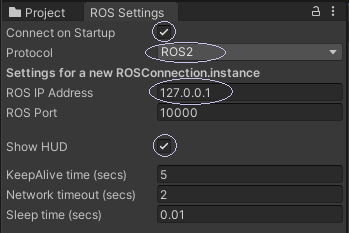

# Setting up the Unity Project

## Open the Unity Project
Assuming you have already [configured your dev environment](dev_env_setup.md), you can open the `Nav2SLAMExampleProject` either by adding it to your Unity Hub or directly from an open editor. 

---

## Open the SimpleWarehouseScene
Find the example scene, SimpleWarehouseScene, in the project browser, located in the bottom left of the editor by default, and open it by double-clicking.  
   
You should see something like this open in your Editor window:

---

## Configure your ROS Settings
Use the `Robotics` drop-down menu to open the `ROS Settings` menu.
  
In the ROS Settings panel:
* Check the `Connect on Startup` checkbox
* Ensure `Protocol` is set to `ROS2`
* Set your `ROS IP Address` to the address of the adapter your ROS2 environment is using. For those using a Docker container on the same machine as per our guidance from the [setup instructions](dev_env_setup), this will be the default: `127.0.0.1`  

  

---

## Continue to running the example
Everything is now configured to [run the example](run_example.md). If you'd like to understand more about how this project is set up and what the different components are doing, you may skip to [Understanding the Project Components]()